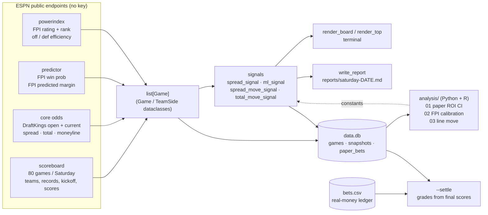
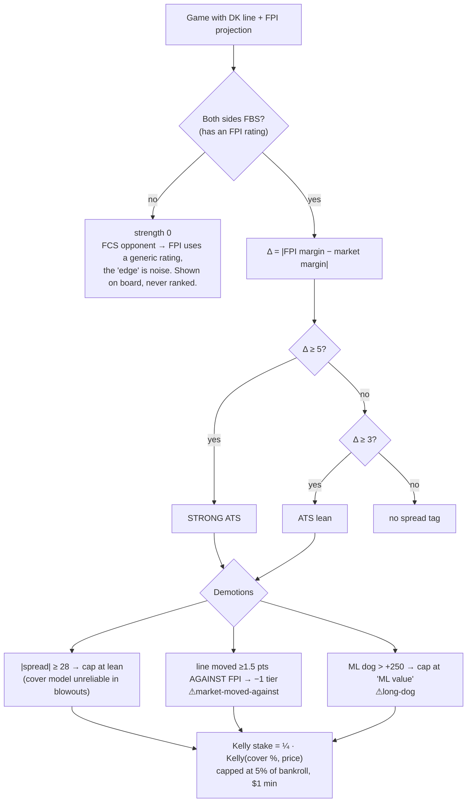
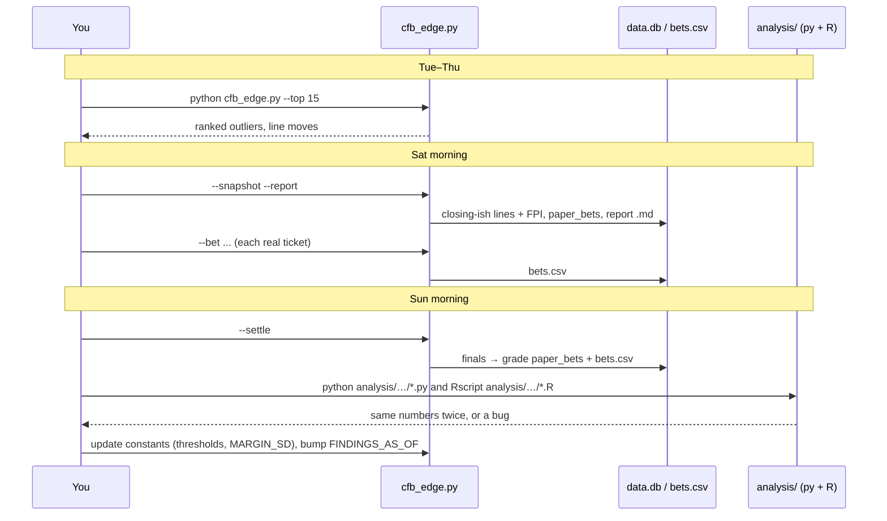
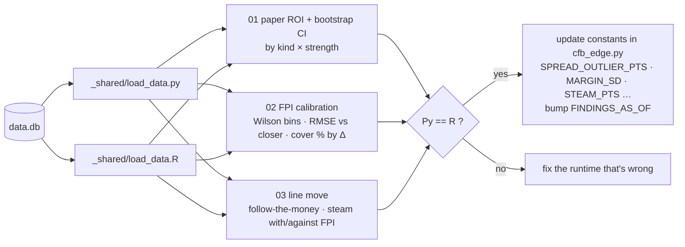
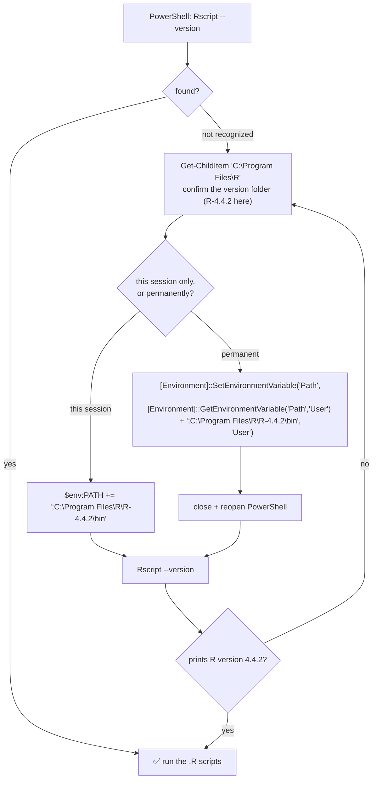

# cfb_2026

> College football outlier finder. One file (`cfb_edge.py`), no API keys. Compares the
> **DraftKings** line (via ESPN) against **ESPN FPI's** game projection for every game on the
> Saturday slate, flags where the model and the market disagree, tracks open→current line
> movement, sizes quarter-Kelly tickets, and writes everything to SQLite so the edge (if
> any) can be **backtested honestly** in Python *and* R.
>
> Sister project of [`horses_worldwide`](../horses_worldwide). Same philosophy: it reads
> public data and produces recommendations. **It does not place bets** — you place them
> yourself, and you log them here so the ledger tells you the truth.

---

## Before you bet — honest expectations (read this first)

**Nothing in this tool is proven +EV yet.** As of 2026‑09‑09 the backfilled sample is
51 FBS‑vs‑FBS games (weeks 0–1). Every verdict is *inconclusive*:

| Question (analysis/ script) | Answer so far (n=51 games / 34 paper bets) |
|---|---|
| Does the paper ledger make money? (`01`) | Flat ROI **−2.1%**, 95% CI [−40%, +41%] — inconclusive |
| Is FPI more accurate than the closer? (`02`) | RMSE **16.41 (FPI) vs 16.68 (DK)** — FPI ahead by 0.27 pts, well inside noise |
| Does the FPI side cover? (`02`) | **53.1%** [39, 66] vs 52.4% break‑even — inconclusive |
| Does following steam work? (`03`) | Moved‑toward side covers **43.5%** [26, 63] — inconclusive |

FPI is a real model and public lines are efficient. The realistic prior for "public power
rating vs closing line" is 50–53% ATS, which at −110 is a coin flip. Treat the first
month as **data collection**: small flat‑ish tickets, log everything, let the analysis
loop decide whether any bucket earns a bigger stake.

---

## Quick start

```powershell
pip install -r requirements.txt

python cfb_edge.py                       # full Saturday board + top-10 outliers
python cfb_edge.py --top 15              # ranked outliers only
python cfb_edge.py --flagged             # board rows that carry a tag
python cfb_edge.py --bankroll 250        # resize the $Bet column
python cfb_edge.py --snapshot --report   # persist lines + FPI, paper-log plays, write reports/saturday-<date>.md
python cfb_edge.py --date 2026-09-19     # any date (default: next Saturday)
```

Sunday morning:

```powershell
python cfb_edge.py --settle              # pull finals, grade paper bets + bets.csv
python cfb_edge.py --paper-show          # paper ledger by signal kind × strength
python cfb_edge.py --bets-show           # your real-money ledger with running ROI
```

Log a real ticket the moment you place it (game id is in the `--report` table or `data.db`):

```powershell
python cfb_edge.py --bet 401856782 --kind spread --side "Oklahoma State" --line 22.5 --price -110 --stake 5
python cfb_edge.py --bet 401856782 --kind ml --side Oregon --price -1800 --stake 10
python cfb_edge.py --bet 401856782 --kind under --line 57.5 --price -108 --stake 5
```

Seed the database with past weeks (ESPN keeps the opener, the closer and the pre‑game FPI
for finished games):

```powershell
python cfb_edge.py --date 2026-09-05 --backfill
```

---

## How it works



### The signals, in trust order



| Signal | What it compares | Fires | Stake? |
|---|---|---|---|
| **ATS** (`spread_signal`) | FPI predicted margin vs DK spread | Δ ≥ 3 pts (lean), ≥ 5 (STRONG) | yes — cover % = Φ(Δ / 13.5) |
| **ML** (`ml_signal`) | FPI win prob vs de‑vigged DK moneyline | edge ≥ +8% (value), ≥ +20% (STRONG) | yes — truth p = FPI win prob |
| **line move** (`spread_move_signal`) | DK opener vs current | ≥ 3 pts | no — it's news (QB, injury, weather), not a model |
| **total steam** (`total_move_signal`) | DK total opener vs current | ≥ 2.5 pts | no — there is no totals model here |

The board also prints `[steam with]` / `[steam against]` whenever the spread moved ≥1.5 pts
since open, and `[crosses 3,7]` when the FPI number and the market number sit on opposite
sides of a key number.

### The weekly loop



`snapshot.bat` is the Task‑Scheduler wrapper: run it every 2–4 h Friday/Saturday so the DB
holds a near‑opener and a near‑closer for every game (closing‑line‑value tracking).

---

## Reading the board

```
Kick CT     Matchup                 DK spread (open)      FPI mrg     Δ  Cov%  ML home/away    FPI%  Total (open)   Tag / $Bet
sat 02:30pm CAL @ SYR               SYR -3.5 (+1.5)         +11.6   8.1    73  -166/+140         80  56.5 (52.5)    STRONG ATS SYR -3.5 [steam with] [crosses 7,10] $5 · STRONG ML SYR -166 (+33%) $5
```

- **DK spread (open)** — home team's number now, opener in parentheses. Syracuse opened +1.5, now −3.5: five points of steam toward the home side.
- **FPI mrg** — FPI's predicted *home* margin. +11.6 means FPI has Syracuse by nearly 12.
- **Δ / Cov%** — |FPI − market| in points and the implied cover probability of the FPI side.
- **FPI%** — FPI home win probability, to compare with the moneyline.
- **Tag / $Bet** — green STRONG, cyan lean/value, red when the market moved against the model. Dollar figure is the quarter‑Kelly ceiling for the `--bankroll` given.

---

## The analysis loop (Python and R, side by side)

Every script exists twice and must print the **same point estimates**. Bootstrap confidence
intervals may differ in the last digit (different RNG streams) — everything else must match,
and a disagreement means a bug.



### Getting `Rscript` on the PATH (one-time)

R installs to `C:\Program Files\R\R-4.4.2in` but does **not** add itself to PATH, so
`Rscript` is "not recognized" in a fresh PowerShell until you do this:



```powershell
# permanent, current user — run once, then reopen PowerShell
[Environment]::SetEnvironmentVariable('Path',
  [Environment]::GetEnvironmentVariable('Path','User') + ';C:\Program Files\R\R-4.4.2in', 'User')

# or just for this window
$env:PATH += ';C:\Program Files\R\R-4.4.2in'
Rscript --version
```

When you upgrade R the folder name changes (e.g. `R-4.5.0`) — repeat with the new path.

```powershell
pip install -r analysis/requirements-py.txt
python analysis/01_paper_roi_ci/paper_roi.py
python analysis/02_fpi_calibration/fpi_calibration.py
python analysis/03_line_move/line_move.py

# R (install once; Rscript lives in C:\Program Files\R\R-4.4.2\bin on this machine)
Rscript -e 'install.packages(readLines("analysis/requirements-r.txt"), repos="https://cloud.r-project.org")'
Rscript analysis/01_paper_roi_ci/paper_roi.R
Rscript analysis/02_fpi_calibration/fpi_calibration.R
Rscript analysis/03_line_move/line_move.R
```

Outputs land in `analysis/_out/` (gitignored). See [`analysis/README.md`](analysis/README.md).

---

## Data sources and gotchas

- **ESPN scoreboard** `site.api.espn.com/.../scoreboard?dates=YYYYMMDD&groups=80&limit=300` — the whole FBS slate incl. FCS visitors. Only one book is exposed (DraftKings).
- **ESPN core odds** `sports.core.api.espn.com/.../events/{id}/competitions/{id}/odds` — has `open` **and** `current` for spread, total and moneyline. For finished games `current` is frozen at the closer, which is what makes `--backfill` possible.
- **ESPN predictor** `.../competitions/{id}/predictor` — FPI `gameProjection` (win %) and `teamPredPtDiff` (margin). `lastModified` is the game‑morning run, so backfilled FPI is genuinely pre‑game.
- **ESPN powerindex** `site.web.api.espn.com/apis/fitt/v3/.../powerindex` — 138 FBS teams. A team missing here is FCS; the tool uses that as the "don't trust the edge" flag.
- **User‑Agent**: a full Chrome UA string gets a **403** from ESPN's Akamai edge; a plain `Mozilla/5.0` passes. Don't "improve" it.
- **Not used**: CollegeFootballData (needs a key), The Odds API (needs a key), Massey (403 to scripts). Multi‑book line shopping would need one of the keyed APIs — the hook is `_apply_core_odds`.

## Files

| File | What |
|---|---|
| `cfb_edge.py` | the tool — everything lives here, section headers navigate it |
| `betting_guide.md` | live‑play reference: thresholds, what to fire on, discipline |
| `CLAUDE.md` | conventions for Claude Code |
| `analysis/` | Python + R twins, offline, read‑only |
| `reports/` | `saturday-<date>.md` — what the tool said before kickoff |
| `snapshot.bat` | Task Scheduler wrapper |
| `data.db`, `bets.csv` | local only, gitignored |
